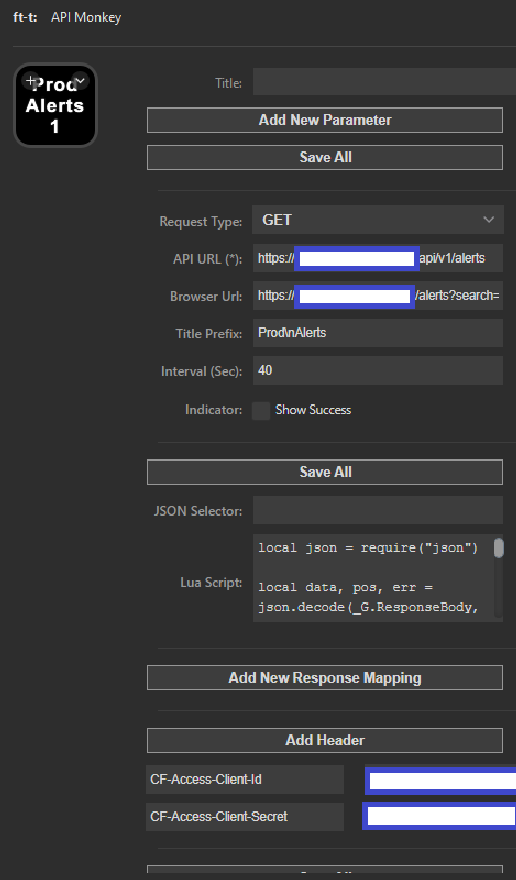

[](https://goreportcard.com/report/github.com/skynet2/singleton-task)
[](https://pkg.go.dev/github.com/skynet2/singleton-task?tab=doc)

# ApiMonkey

**ApiMonkey** is a powerful StreamDeck plugin designed for developers, IT professionals, and enthusiasts who require a seamless way to send HTTP/HTTPS requests directly from their StreamDeck. With its advanced features and customization options, ApiMonkey stands out by providing enhanced functionality for automated workflows and interactions with web services.

## Features

ApiMonkey goes beyond simple HTTP/HTTPS request functionalities, offering a range of advanced features that set it apart from analogs:

### Request features
- **Go Templating Support**: Utilize Go Templating for dynamic fields such as URL, Body, Browser URL, and Title, allowing for highly customizable request configurations.
- **Custom Headers**: Define custom headers for your requests, providing additional flexibility and support for various APIs that require specific header configurations.

### Response features
- **JSON Selector**: Extract specific fields from a JSON response using a json selector syntax, This feature enables precise control over the data you want to interact with from your responses.
- **Lua Scripting**: Execute custom LUA scripts with parameters for extended functionality. This allows for virtually limitless possibilities in processing responses.
- **Response Mapping to Images**: Map specific response strings to images on your StreamDeck.

## Installation

1. Download the latest release from the [releases page](https://github.com/ft-t/apimonkey/releases)
2. Extract zip archive to your StreamDeck plugins folder (example - `C:\Users\<your user>\AppData\Roaming\Elgato\StreamDeck\Plugins`)
3. Restart StreamDeck application
4. Open StreamDeck and add the ApiMonkey plugin to your profile
5. Configure your requests and enjoy!

## Example Usage

### Lua Scripting
#### Available fields in lua:
- `_G.ResponseBody` - (string) The response body
- `_G.ResponseStatusCode` - (int) The response status code

**Note: please always return a value from the lua script, otherwise the button will not be updated.**

#### Lua Script example
This example handles response from prometheus alert manager and sets alert count as text in the button.
```lua
local json = require("json")

local data, pos, err = json.decode(_G.ResponseBody, 1, nil)

local totalCount = 0

for _, alert in ipairs(data.data.alerts) do
  if alert.state == "firing" then
    local isWatchdog = false
    if alert.labels ~= nil then
      isWatchdog = alert.labels.alertname == "Watchdog"
    end

    if isWatchdog == false then
      totalCount = totalCount + 1
    end
  end
end

return totalCount
```

