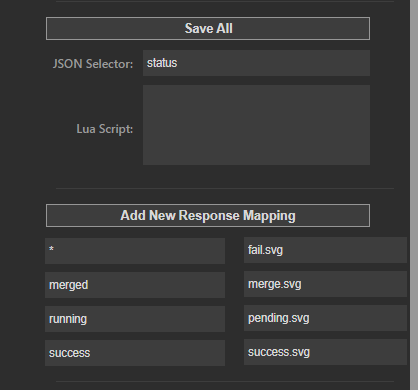

[](https://codecov.io/github/ft-t/apimonkey)
[](https://goreportcard.com/report/github.com/ft-t/apimonkey)
[](https://pkg.go.dev/github.com/ft-t/apimonkey?tab=doc)

# ApiMonkey

**ApiMonkey** is a powerful StreamDeck plugin designed for developers, IT professionals, and enthusiasts who require a seamless way to send HTTP/HTTPS requests directly from their StreamDeck. With its advanced features and customization options, ApiMonkey stands out by providing enhanced functionality for automated workflows and interactions with web services.

## Features

ApiMonkey goes beyond simple HTTP/HTTPS request functionalities, offering a range of advanced features that set it apart from analogs:

### Request features
- **Go Templating Support**: Utilize Go Templating for dynamic fields such as URL, Body, Browser URL, and Title, allowing for highly customizable request configurations.
- **Custom Headers**: Define custom headers for your requests, providing additional flexibility and support for various APIs that require specific header configurations.

### Response features
- **JSON Selector**: Extract specific fields from a JSON response using a json selector syntax, This feature enables precise control over the data you want to interact with from your responses.
- **Lua Scripting**: Execute custom LUA scripts with parameters for extended functionality. This allows for virtually limitless possibilities in processing responses.
- **Response Mapping to Images**: Map specific response strings to images on your StreamDeck.

## Installation

1. Download the latest release from the [releases page](https://github.com/ft-t/apimonkey/releases)
2. Extract zip archive to your StreamDeck plugins folder (example - `C:\Users\<your user>\AppData\Roaming\Elgato\StreamDeck\Plugins`)
3. Restart StreamDeck application
4. Open StreamDeck and add the ApiMonkey plugin to your profile
5. Configure your requests and enjoy!

### Custom Headers
You can define custom headers for your requests.


### JSON Selector
If API response is JSON and you want to extract some specific values from this json response, you can use JSON Selector.
JSON Selector functionality is based on GoLang implementation of https://github.com/tidwall/gjson library

### Response Mapping
You can map specific response strings to images or text on your StreamDeck.
You can unlimited number of mappings.



In this specific example we are mapping `status` field to our mapping table:
- `status = merged` will show `merge.svg` on your StreamDeck
- `status = running` will show `pending.svg` on your StreamDeck
- `status = success` will show `success.svg` on your StreamDeck
- `*` stands for all other cases, not defined in mapping table, it will show `failed.svg` on your StreamDeck

### Go Templating
#### Available fields in for templating:
- `API URL` - The URL of the API
- `Body` - The body of the request (POST\PUT)
- `Browser URL` - The URL of the browser (will be opened on button click)
- `Title Prefix` - The title prefix for StreamDeck button
- `Headers` - The headers of the request

#### Go Templating example
As per screenshot, we defined two template variables
- `PrID` - in this context pull request id
- `ProjectID` - id of the project
  

We can now use these variables in request fields, for example per our screenshot:

`API URL = https://gitlab.com/api/v4/projects/{{.ProjectID}}/merge_requests/{{.PrID}}/pipelines`
`Browser URL = https://gitlab.com/someorg/org1/sub1/project/-/merge_requests/{{.PrID}}`

Note: use Golang templating syntax for templating. For more information, please refer to the [Golang templating documentation](https://pkg.go.dev/text/template).

#### Example
```
{
  "name": {"first": "Tom", "last": "Anderson"},
  "age":37,
  "children": ["Sara","Alex","Jack"],
  "fav.movie": "Deer Hunter",
  "friends": [
    {"first": "Dale", "last": "Murphy", "age": 44, "nets": ["ig", "fb", "tw"]},
    {"first": "Roger", "last": "Craig", "age": 68, "nets": ["fb", "tw"]},
    {"first": "Jane", "last": "Murphy", "age": 47, "nets": ["ig", "tw"]}
  ]
}
```
Selectors:
```
"name.last"          >> "Anderson"
"age"                >> 37
"children"           >> ["Sara","Alex","Jack"]
"children.#"         >> 3
"children.1"         >> "Alex"
"child*.2"           >> "Jack"
"c?ildren.0"         >> "Sara"
"fav\.movie"         >> "Deer Hunter"
"friends.#.first"    >> ["Dale","Roger","Jane"]
"friends.1.last"     >> "Craig"
```

**For selector syntax please refer to the [gjson documentation](https://github.com/tidwall/gjson?tab=readme-ov-file#path-syntax)**

### Lua Scripting
#### Available fields in lua:
- `_G.ResponseBody` - (string) The response body
- `_G.ResponseStatusCode` - (int) The response status code

Lua script execution is based on [gopher-lua](https://github.com/yuin/gopher-lua) library.

Active Lua plugins:
- `https://github.com/layeh/gopher-json` - for JSON encoding/decoding

**Note: please always return a value from the lua script, otherwise the button will not be updated.**

#### Lua Script example
This example handles response from prometheus alert manager and sets alert count as text in the button.
```lua
local json = require("json")

local data, pos, err = json.decode(_G.ResponseBody, 1, nil)

local totalCount = 0

for _, alert in ipairs(data.data.alerts) do
  if alert.state == "firing" then
    local isWatchdog = false
    if alert.labels ~= nil then
      isWatchdog = alert.labels.alertname == "Watchdog"
    end

    if isWatchdog == false then
      totalCount = totalCount + 1
    end
  end
end

return totalCount
```


## Dependencies
- [streamdeck-sdk-go](https://github.com/tystuyfzand/streamdeck-sdk-go) - StreamDeck SDK for Go
- [streamdeck-easypi](https://github.com/BarRaider/streamdeck-easypi) - EasyPI for StreamDeck
- [gopher-lua](https://github.com/yuin/gopher-lua) - Lua VM in Go
- [gjson](https://github.com/tidwall/gjson) - JSON parser for Go