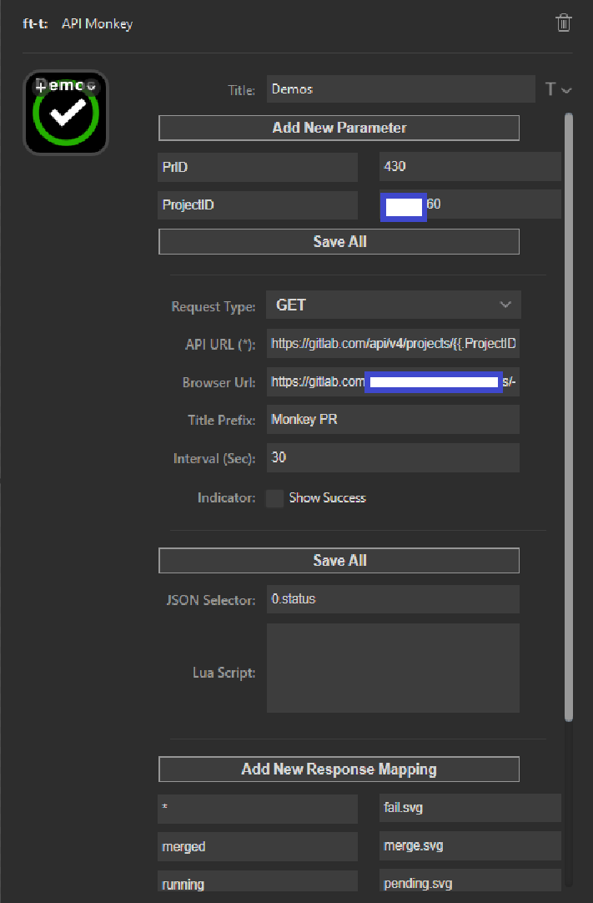
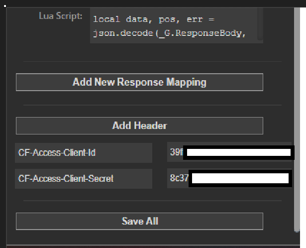
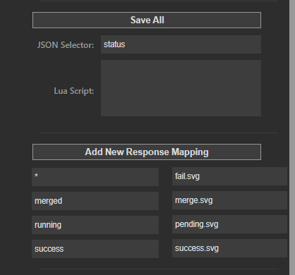

# Features and usage

API Monkey turns a Stream Deck key into an HTTP client. A key can refresh an endpoint on a schedule, execute the request when pressed, open a related browser URL, or run a Lua action.

## Request and response flow

For every request, API Monkey performs these steps in order:

1. Render the API URL, request body, and header values as Go templates.
2. Send the HTTP request.
3. Apply the JSON selector when one is configured.
4. Run the response Lua script when one is configured.
5. Apply the response mapping when one is configured.
6. Update the key title or image.

The JSON selector therefore receives the raw response body. Response Lua receives the selected value, or the raw response body when no selector is configured. Response mappings receive the final Lua result, or the selected/raw value when response Lua is not configured.

## Configuration reference

Select **Save All** after changing settings.

| Setting | Purpose |
| --- | --- |
| Parameters | Named values available to Go templates. |
| Button Action | Chooses what happens when the key is pressed. |
| Request Type | HTTP method: `GET`, `POST`, `PUT`, `DELETE`, or `PATCH`. |
| API URL | Request URL. Supports Go templates. |
| TLS Verification | Allows certificate errors when enabled. Use only for endpoints you trust. |
| Request Body | Body sent for non-GET requests. Supports Go templates. |
| Browser URL | URL opened by the `Open Browser` action. Supports Go templates. |
| Title Prefix | Text placed above the result. Supports Go templates; use `\n` for a line break. |
| Polling | Refresh interval in seconds. `0` disables repeated polling. Negative values are invalid. |
| Show Success | Shows Stream Deck's success indicator after a successful refresh or key action. |
| JSON Selector | GJSON path used to extract one value from a JSON response. |
| Lua Script | Response-processing Lua script. |
| Action Lua Script | Script run by the `Execute Lua` key action. |
| Response Mapping | Maps final response values to text or image files. |
| Headers | HTTP header names and values. Values support Go templates. |

## Polling and key actions

API Monkey refreshes once when a configured key appears. A positive **Polling** value schedules later refreshes at that interval. `0` prevents repeated background requests.

Polling is independent from **Button Action**:

- **Open Browser** opens **Browser URL**. When it is empty, API Monkey opens **API URL** instead.
- **Refresh Request** executes the configured request once and runs the normal response pipeline.
- **Execute Lua** runs **Action Lua Script**. See the [Lua reference](lua.md#action-lua).

Only one key action can run for a key at a time. Additional presses are ignored until that action finishes. Background polling remains independent.

## Go templates

Add key-value pairs under **Parameters**, then reference them with Go `text/template` syntax. Templates are supported in:

- API URL
- Request Body
- header values
- Browser URL
- Title Prefix

Example parameters:

| Key | Value |
| --- | --- |
| `ProjectID` | `42` |
| `MergeRequestID` | `17` |

Example fields:

```text
API URL: https://gitlab.example/api/v4/projects/{{.ProjectID}}/merge_requests/{{.MergeRequestID}}
Browser URL: https://gitlab.example/projects/{{.ProjectID}}/merge_requests/{{.MergeRequestID}}
Title Prefix: MR {{.MergeRequestID}}
```



An invalid template stops the request or action and displays an alert on the key.

## Headers and request bodies

Use **Headers** for authentication, content types, and API-specific values. Header values, but not header names, support Go templates.



Example JSON request:

```text
Request Type: POST
API URL: https://example.test/api/jobs
Request Body: {"project":"{{.ProjectID}}","action":"start"}
Header: Content-Type = application/json
Header: Authorization = Bearer {{.Token}}
```

API Monkey does not attach a body to `GET` requests. For other methods, an empty body is omitted.

### TLS verification

**Ignore certificate errors** selects an HTTP client that skips server certificate verification. This exposes requests and credentials to man-in-the-middle attacks. Use it only for trusted development endpoints that cannot provide a valid certificate.

## JSON selectors

**JSON Selector** uses [GJSON path syntax](https://github.com/tidwall/gjson/blob/master/SYNTAX.md). Leave it empty to pass the complete response body to later processing.

Given:

```json
{
  "name": {"first": "Tom", "last": "Anderson"},
  "children": ["Sara", "Alex", "Jack"],
  "fav.movie": "Deer Hunter",
  "friends": [
    {"first": "Dale", "age": 44},
    {"first": "Roger", "age": 68}
  ]
}
```

Useful selectors:

| Selector | Result |
| --- | --- |
| `name.last` | `Anderson` |
| `children.#` | `3` |
| `children.1` | `Alex` |
| `fav\.movie` | `Deer Hunter` |
| `friends.#.first` | `["Dale","Roger"]` |
| `friends.#(age>50).first` | `Roger` |

A selector that does not match, or resolves to an empty string, makes the request fail and displays the failure state.

## Response mappings

Response mappings compare their keys with the final processed response:

- An exact key maps one response value.
- `*` is the fallback when no exact key exists.
- A value ending in `.png` or `.svg` is loaded as a key image.
- Any other value is displayed as key text.



Example:

| Response | Mapping value |
| --- | --- |
| `running` | `pending.svg` |
| `success` | `success.svg` |
| `*` | `fail.svg` |

Relative image names resolve inside the installed plugin's `images` directory. Absolute paths are also accepted. A configured mapping with neither an exact match nor a fallback fails instead of displaying the raw value.

## Response Lua

Use **Lua Script** when a selector is insufficient—for example, to count records or combine multiple fields. Response Lua runs after the JSON selector and before response mapping.

```lua
local json = require("json")
local data, err = json.decode(ResponseBody)

if err ~= nil then
  error(err)
end

return #data.items
```

See [Lua scripting](lua.md) for globals, return behavior, HTTP actions, errors, and more examples.

## Complete examples

### Display a GitHub Actions run result

```text
Button Action: Refresh Request
Request Type: GET
API URL: https://api.github.com/repos/{{.Owner}}/{{.Repository}}/actions/runs?per_page=1
Polling: 60
JSON Selector: workflow_runs.0.conclusion
Header: Accept = application/vnd.github+json
Title Prefix: CI
Mapping: success = success.svg
Mapping: failure = fail.svg
Mapping: * = pending.svg
```

### Open a templated project page

```text
Button Action: Open Browser
API URL: https://gitlab.example/api/v4/projects/{{.ProjectID}}
Browser URL: https://gitlab.example/projects/{{.ProjectID}}
Polling: 0
```

### Run an on-demand webhook

Select **Execute Lua** and use:

```lua
local response = http.request({
  method = "POST",
  url = ButtonConfig.apiUrl,
  headers = {
    Authorization = ButtonConfig.headers.Authorization,
    ["Content-Type"] = "application/json"
  },
  body = ButtonConfig.body,
  timeout_seconds = 10
})

return response.status_code
```

## Troubleshooting

- A red alert means configuration validation, templates, the HTTP request, Lua, selection, or mapping failed.
- Check `logs/log.log` inside the installed plugin directory for the underlying error.
- Confirm **Save All** was selected after editing settings.
- Test selectors against the raw response, before Lua processing.
- Add a `*` response mapping when every result should have a display value.
- Add `timeout_seconds` to action Lua HTTP calls when the remote service may stall.
